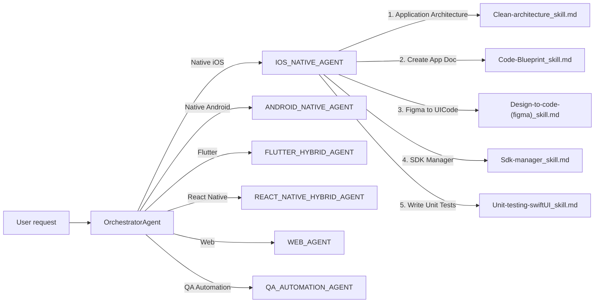

# How the Orchestrator Agent Works

This document explains the routing architecture used in this repository, using the
**Native iOS** path (`OrchestratorAgent` → `IOS_NATIVE_AGENT` → iOS skills) as the
worked example.

## Architecture Overview

The system is built as a **3-tier routing chain**. Each tier has exactly one job and
never performs work that belongs to the tier below it.

| Tier | Location | Responsibility |
|---|---|---|
| 1. Orchestrator | [.github/agents/ORCHESTRATOR_AGENT.md](../.github/agents/ORCHESTRATOR_AGENT.md) | Route the user to a **platform** agent. Nothing else. |
| 2. Platform Router | e.g. [.github/agents/IOS_NATIVE_AGENT.md](../.github/agents/IOS_NATIVE_AGENT.md) | Route the user to a **skill** within that platform. Nothing else. |
| 3. Skill | e.g. [.github/skills/mobile/iOS/Clean-architecture_skill.md](../.github/skills/mobile/iOS/Clean-architecture_skill.md) | Actually performs the work (generates code, docs, tests, etc.). |



## Golden Rule: Each Tier Only Routes

Every router agent (Orchestrator and Platform routers) follows the same strict
contract:

- Never gather requirements or ask follow-up questions.
- Never generate code, architecture, or tests.
- Never answer technical questions.
- Display a numbered menu, accept a selection (by name or number), and **immediately
  delegate** to the next tier.
- Never do the work of the tier it routes to.

Only the **skill** (tier 3) is allowed to actually implement anything.

## Step-by-Step Walkthrough: Native iOS

### Step 1 — Orchestrator routes to a platform

The user opens `@OrchestratorAgent` (or asks a general question). It displays:

```
Available Platforms

1. Native iOS
2. Native Android
3. Flutter
4. React Native
5. Web
6. QA Automation

Please select a platform by name or number.
```

When the user picks **"Native iOS"** (or `1`), the Orchestrator does not ask anything
else — it immediately delegates to `@IOS_NATIVE_AGENT` as defined in its
[Routing section](../.github/agents/ORCHESTRATOR_AGENT.md#routing).

### Step 2 — Platform router (`IOS_NATIVE_AGENT`) routes to a skill

`IOS_NATIVE_AGENT` is itself just a router, scoped to Native iOS. It displays exactly
five options:

```
Available Native iOS Skills

1. Application Architecture(Create app)
2. Create App Doc
3. Figma to UICode
4. SDK Manager(Package Manager)
5. Write Unit Tests

Please select a capability by name or number.
```

Each option maps to a skill file on disk under
[.github/skills/mobile/iOS/](../.github/skills/mobile/iOS/):

| # | Capability | Skill file |
|---|---|---|
| 1 | Application Architecture (Create app) | [Clean-architecture_skill.md](../.github/skills/mobile/iOS/Clean-architecture_skill.md) |
| 2 | Create App Doc | [Code-Blueprint_skill.md](../.github/skills/mobile/iOS/Code-Blueprint_skill.md) |
| 3 | Figma to UICode | [Design-to-code-(figma)_skill.md](../.github/skills/mobile/iOS/Design-to-code-(figma)_skill.md) |
| 4 | SDK Manager (Package Manager) | [Sdk-manager_skill.md](../.github/skills/mobile/iOS/Sdk-manager_skill.md) |
| 5 | Write Unit Tests | [Unit-testing-swiftUI_skill.md](../.github/skills/mobile/iOS/Unit-testing-swiftUI_skill.md) |

Like the Orchestrator, `IOS_NATIVE_AGENT` never implements anything itself — it
resolves the selection to one of the five files above and passes control directly to
it.

### Step 3 — The skill does the actual work

Only the invoked skill performs real work. For example, if the user selected
**"Application Architecture(Create app)"**, control passes to
`Clean-architecture_skill.md`, which then:

- Asks its own scoped implementation questions (deployment target, project name, etc.)
- Generates the full Xcode project (`.xcodeproj`, sources, tests, schemes)
- Runs the build and reports results

If the user instead selected **"Figma to UICode"**, control passes to
`Design-to-code-(figma)_skill.md`, which follows its own contract (ask platform,
pull from Figma MCP, generate SwiftUI code, run similarity checks, etc.).

### End-to-end example

```
User:        "I want to build something for iOS"
Orchestrator: Available Platforms
              1. Native iOS
              2. Native Android
              ...
User:        "1"
Orchestrator: → delegates to @IOS_NATIVE_AGENT

IOS_NATIVE_AGENT: Available Native iOS Skills
                  1. Application Architecture(Create app)
                  2. Create App Doc
                  3. Figma to UICode
                  4. SDK Manager(Package Manager)
                  5. Write Unit Tests
User:             "3"
IOS_NATIVE_AGENT: → invokes skills/mobile/iOS/Design-to-code-(figma)_skill.md

Design-to-code-(figma)_skill: (now does the real work: Figma → SwiftUI)
```

## Applying This Pattern to Other Platforms

Every other platform router (`ANDROID_NATIVE_AGENT`, `FLUTTER_HYBRID_AGENT`,
`REACT_NATIVE_HYBRID_AGENT`, `WEB_AGENT`, `QA_AUTOMATION_AGENT`) follows the exact
same two rules as `IOS_NATIVE_AGENT`:

1. Display a fixed menu of skills for that platform, and nothing else.
2. On selection, immediately invoke the matching skill file under
   `.github/skills/mobile/<platform>/` (or `.github/skills/web/` for Web), and let
   the skill perform the implementation.

This keeps routing logic (Orchestrator + platform routers) completely decoupled from
implementation logic (skills), so new skills can be added under a platform without
ever touching the Orchestrator.
