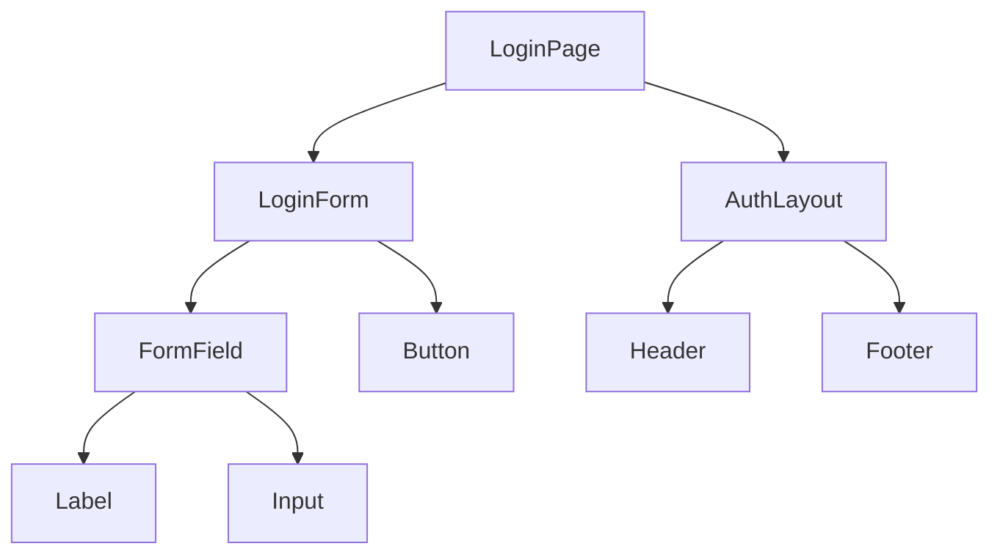

# Component Map Skill

This skill generates a **component map** for a React JS project — a structured inventory of all components, their atomic level, and their relationships.

---

## What Is a Component Map?

A component map documents:

- Every component in the project
- Its atomic level (atom / molecule / organism / template / page)
- Its props interface
- Which components it uses (dependencies)
- Which features it belongs to

---

## How to Use This Skill

Provide the agent with:

1. The `src/` folder structure (or paste file paths)
2. Any existing component files you want included

The agent will:

1. Scan the component tree
2. Classify each component by atomic level
3. Generate the component map as a Markdown table and Mermaid diagram
4. Identify any misclassified or misplaced components

---

## Output Format

### Component Inventory Table

| Component | Atomic Level | Feature | Props | Uses |
|---|---|---|---|---|
| `Button` | Atom | Shared | `label`, `onClick`, `variant` | — |
| `FormField` | Molecule | Shared | `label`, `error`, `children` | `Label`, `Input` |
| `LoginForm` | Organism | Auth | `onSubmit` | `FormField`, `Button` |
| `AuthLayout` | Template | Auth | `children` | `Header`, `Footer` |
| `LoginPage` | Page | Auth | — | `AuthLayout`, `LoginForm` |

---

### Mermaid Component Diagram

---

## Capabilities

- Generate a component map from an existing project
- Generate a component map blueprint for a new project before coding
- Detect orphaned components (defined but never used)
- Detect prop drilling chains that should be replaced with Context or Redux
- Suggest missing components based on the UI requirements

---

## Rules

- Every component must have exactly one atomic level.
- Page components must never be reused — they are route-level only.
- Template components accept only `children` and layout-related props.
- Organisms must not import from other organisms directly (use composition at the page level).

---

*This is a skill used by the @REACT_JS_AGENT agent.*
